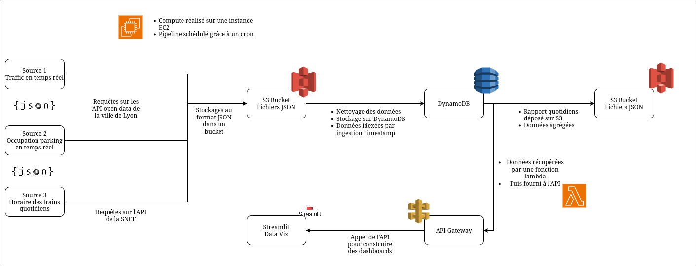

# Paris Public Data Analytics Platform

## Overview

This project is a comprehensive data processing and analytics pipeline built on AWS. It is designed to handle the ingestion, processing, and analysis of public data from the city of Paris, including real-time traffic information, parking availability, and public transport departures. The platform provides a serverless REST API for data access and an interactive dashboard for visualization.

## Architecture



The architecture is designed to be scalable and resilient, leveraging key AWS services:

- **Data Ingestion**: Python scripts running on an EC2 instance periodically fetch data from various public data sources and APIs. This raw data is then stored in an AWS S3 bucket, which acts as the data lake's landing zone (Bronze Layer).

- **Data Processing**: A set of Python scripts, also running on the EC2 instance, process the raw data from S3. This involves cleaning, transformation, and enrichment of the data, which is then loaded into AWS DynamoDB tables for optimized access (Silver Layer).

- **Data Aggregation & Reporting**: A dedicated reporting script runs periodically to create aggregated analytics from the processed data. These aggregations are stored in their own DynamoDB tables, representing the Gold Layer of the data lakehouse.

- **API Layer**: A serverless REST API is built using AWS Lambda and Amazon API Gateway. This API provides endpoints to query the processed and aggregated data from DynamoDB, offering a scalable and cost-effective way to expose the data to client applications.

- **Data Visualization**: An interactive dashboard built with Streamlit allows users to explore the data and gain insights from the analytics generated by the platform.

## Features

- **Automated Data Pipelines**: Scripts for ingesting and processing real-time data for Paris traffic, parking, and public transport.
- **Scalable Data Storage**: Utilizes AWS S3 for raw data storage and DynamoDB for processed and aggregated data.
- **Serverless REST API**: A scalable and cost-efficient API for data retrieval, built with AWS Lambda and API Gateway.
- **Data Aggregation**: Generates analytical reports on traffic, parking, and public transport trends.
- **Interactive Dashboard**: A Streamlit dashboard for easy data visualization and exploration.

## Project Structure

```
/home/tonio/Workspace/efrei/m2/project_cloud/
├───.gitignore
├───.python-version
├───pipeline_departures.sh
├───pipeline_reporting.sh
├───pipeline.sh
├───pyproject.toml
├───README.md
├───uv.lock
└───src/
    └───project_cloud/
        ├───agregation/
        ├───api/
        ├───dashboards/
        ├───departures/
        ├───parking/
        ├───reporting/
        ├───traffic/
        └───utils/
```

## Getting Started

### Prerequisites

- An AWS Account with appropriate permissions.
- AWS CLI configured on your local machine.
- Python 3.12+
- `uv` Python package manager: [Installation here](https://uv.readthedocs.io/en/latest/installation.html)

### Installation

1.  **Clone the repository**:
    ```bash
    git clone <repository-url>
    cd project_cloud
    ```

2.  **Configure AWS Credentials**:
    Ensure your AWS CLI is configured with the necessary credentials to deploy and manage resources.
    ```bash
    aws configure
    ```

3.  **Install Python dependencies**:
    Use `uv` to install the required packages from the lock file.
    ```bash
    uv sync --locked
    ```

### Deployment and Usage

1. **Run the Data Pipelines**:
    The data pipelines are designed to be run on an EC2 instance. You can run the main pipeline script which orchestrates the ingestion and processing of all data sources.
    ```bash
    ./pipeline.sh
    ```
    You can also run individual pipelines:
    ```bash
    uv run ingest-parking
    uv run process-parking
    uv run ingest-traffic
    uv run process-traffic
    uv run ingest-departures
    uv run process-departures
    uv run create-reports
    ```

2. **Run the Dashboard**:
    Launch the Streamlit dashboard to visualize the data.
    ```bash
    uv run streamlit run src/project_cloud/dashboards/traffic_dashboard.py
    ```

## API Endpoints

The REST API provides access to the latest processed data as well as aggregated reports.

### Real-time Data Endpoints
-   `GET /parkings`: Retrieves the latest parking availability data.
-   `GET /traffic`: Retrieves the latest traffic data.
-   `GET /departures`: Retrieves the latest public transport departure data.

### Aggregated Data Endpoints
-   `GET /aggregation_average_availability_parking`: Average parking availability.
-   `GET /aggregation_number_of_parkings_in_operation`: Number of parkings in operation.
-   `GET /aggregation_overall_occupancy_rate`: Overall parking occupancy rate.
-   `GET /aggregation_reference_pricing`: Reference pricing for parkings.
-   `GET /aggregation_traffic_congestion_index`: Traffic congestion index.
-   `GET /aggregation_traffic_critical_segments`: Critical traffic segments.
-   `GET /aggregation_traffic_fluidity_by_zone`: Traffic fluidity by zone.
-   `GET /aggregation_departures_by_network`: Departures by transport network.
-   `GET /aggregation_departures_top_destinations`: Top departure destinations.
-   `GET /aggregation_departures_total`: Total departures.

## Data Analytics

The platform generates several key analytics to provide insights into the city's public services:

-   **Parking Analysis**: Monitors parking availability, occupancy rates, and pricing across the city.
-   **Traffic Analysis**: Provides insights into traffic congestion, identifies critical segments, and analyzes traffic fluidity by zone.
-   **Departures Analysis**: Tracks train departures, including statistics by network and popular destinations.